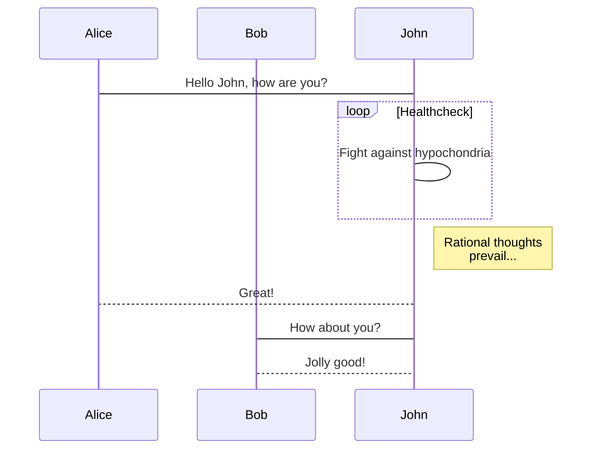

# 見出し1

あいうえお

## 見出し2

あいうえお

### 見出し3

あいうえお

#### 見出し4

あいうえお

- ひとつめ
- ふたつめ
  - ネスト
- みっつめ

# コード

```ruby
# The Greeter class
class Greeter
  def initialize(name)
    @name = name.capitalize
  end

  def salute
    puts "Hello #{@name}!"
  end
end

# Create a new object
g = Greeter.new("world")

# Output "Hello World!"
g.salute
```


# Twitter埋め込み




# mermaid



