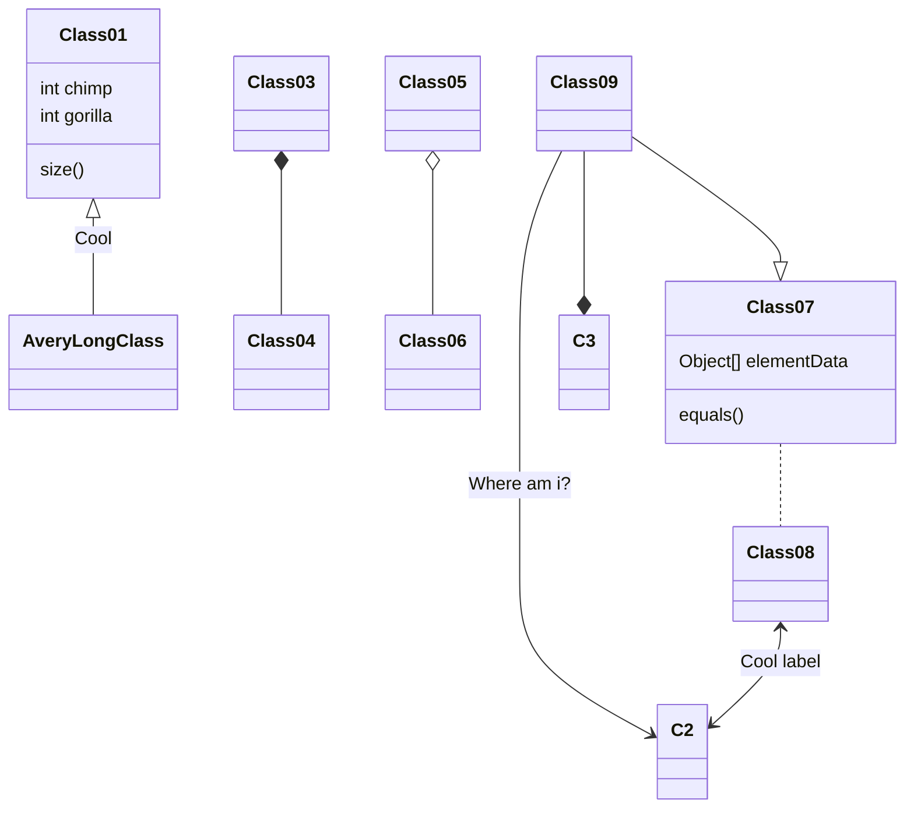
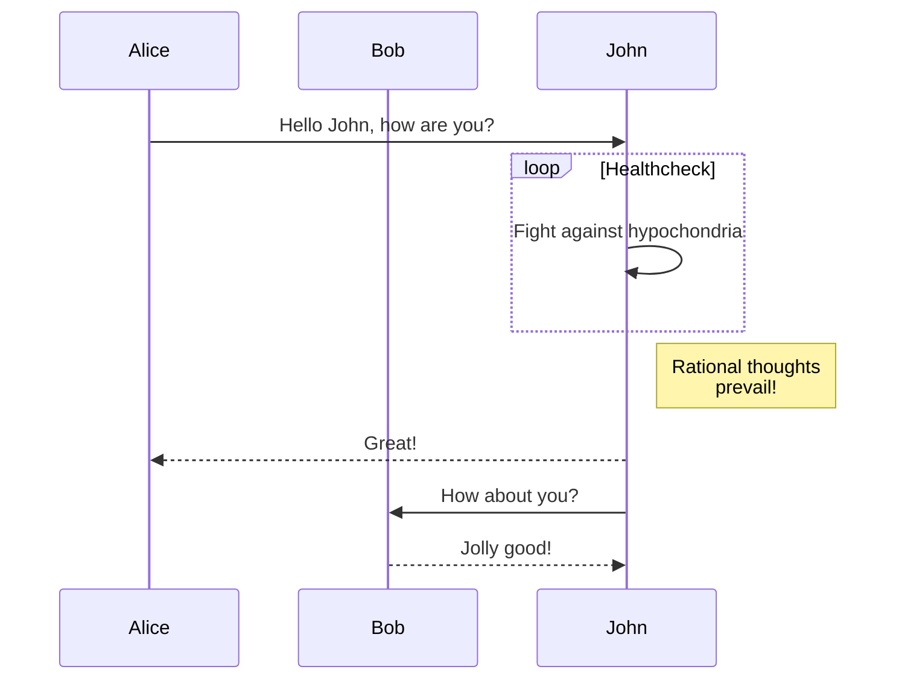

## はじめに

- 網羅はしておらず、よく使うものだけ。
- 自分用なのもあって、下記が全部混ざっているので、部分的に参考にする方は注意してください（この記事を書いてる現在、ブログはWowchemyで運用しています）
  - markdown
    - [https://github.com/adam-p/markdown-here/wiki/Markdown-Cheatsheet](https://github.com/adam-p/markdown-here/wiki/Markdown-Cheatsheet)
  - Hugo Shortcodes
    - [https://gohugo.io/content-management/shortcodes/](https://gohugo.io/content-management/shortcodes/)
  - Wowchemy Shortcodes
    - [https://wowchemy.com/docs/writing-markdown-latex/](https://wowchemy.com/docs/writing-markdown-latex/)

{}

## 基本

```
※ H1は記事タイトルで使われるので使わない
## Heading 2
### Heading 3
#### Heading 4

Italics with _underscores_.
Bold with **asterisks**.
Combined emphasis with **asterisks and _underscores_**.
Strikethrough with ~~two tildes~~.

Inline `code` has `back-ticks around` it.

> This is a blockquote.
```

## リスト

```
1. First item
2. Another item

- First item
- Another item

- [x] Write math example
- [x] Write diagram example
- [ ] Do something else
```

1. First item
2. Another item

- First item
- Another item

- [x] Write math example
- [x] Write diagram example
- [ ] Do something else

## Footnotes

```
I have more [^1] to say.
[^1]: Footnote example.
```

I have more [^1] to say.
[^1]: Footnote example.

## テーブル

```
Markdown | Less | Pretty
--- | --- | ---
*Still* | `renders` | **nicely**
1 | 2 | 3
```

Markdown | Less | Pretty
--- | --- | ---
*Still* | `renders` | **nicely**
1 | 2 | 3

## 水平線

ここと

***

ここの間に水平線

## リンク

[リンク](https://www.example.com)

```
[リンク](https://www.example.com)
```

[他コンテンツへのリンク]()

```
[他コンテンツへのリンク]()
```

{}Download file{}

```
{}Download file{}
```

## コードブロック

```ruby
def hi
  puts "Hello World!"
end
```

## 画像(figure)

```

```



```

```



## gist埋め込み

```

```



## Twitter埋め込み

```

```



## YouTube埋め込み

```

```



## 目次

```

```

## callout

```
{}
A Markdown callout is useful for displaying notices, hints, or definitions to your readers.
{}
```

{} A Markdown callout is useful for displaying notices, hints, or definitions to your readers. {}

```
{}
Here's some important information...
{}
```

{} Here's some important information... {}

## 絵文字

https://www.webfx.com/tools/emoji-cheat-sheet/

```
I : heart : Wowchemy : smile :
```

I :heart: Wowchemy :smile:

## diagrams(mermaid.js)

https://mermaid-js.github.io/mermaid/





## その他

- 開いているページのタイトルとURLをMarkdown形式でコピーするChrome Extension
  - https://chrome.google.com/webstore/detail/copy-title-and-url-as-mar/fpmbiocnfbjpajgeaicmnjnnokmkehil

- ローカルで確認
  - `hugo server -D -F`
    - `-F` 未来時刻の記事を含める
    - `-D` draftを含める
