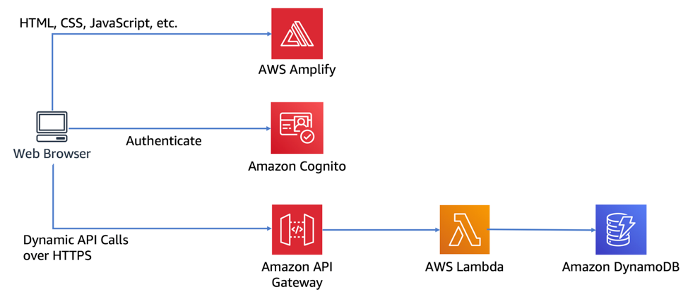
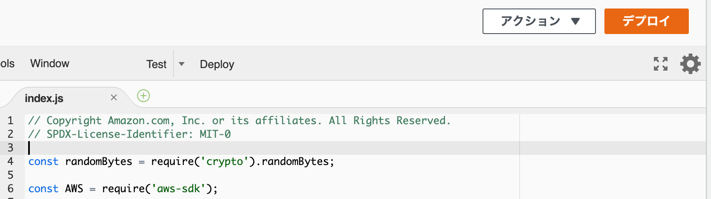

AWS Lambda に入門したので、やったことと理解したことのメモ

## 概要を読んだ

[AWS Lambda（イベント発生時にコードを実行）| AWS](https://aws.amazon.com/jp/lambda/)

利点・仕組み・ユースケースを流し読みした。

## 価格と無料枠を確認した

[料金 - AWS Lambda ｜AWS](https://aws.amazon.com/jp/lambda/pricing/) を読んだ。

> AWS Lambda の無料利用枠には、1 か月ごとに 100 万件の無料リクエスト、および 40 万 GB-秒のコンピューティング時間が、それぞれ含まれます。

`40 万 GB-秒のコンピューティング時間` って？と思ったが、例を読んだらすぐ分かった。

1GB（1024MB）のメモリを割り当てた場合に40万秒実行できるので、最低の128MBのメモリで実行した場合は
`400000 秒 * 1024 MB / 128 MB = 3200000 秒` 使える。

もし実行に10秒かかっても32万回。 軽めの処理で試す分には、気にしないで実行しまくって大丈夫そうだなと思った。

ただし以下 は注意が必要そうなので覚えておく。Provisioned Concurrency も後で確認する。

- > Lambda の無料利用枠は、Provisioned Concurrency が有効になっている関数には適用されません。
- > 現在のところ、Lambda@Edge に無料利用枠はありません。
- > 同じ AWS リージョン内における Amazon S3、Amazon Glacier、Amazon DynamoDB、Amazon SES、Amazon SQS、Amazon Kinesis、Amazon ECR、Amazon SNS、Amazon EFS、または Amazon SimpleDB と AWS Lambda 関数の間でのデータ転送は無料です。AWS Lambda 関数での VPC または VPC ピアリングの使用には、こちらで説明されている追加料金が発生します。

## Hello World してみた

チュートリアルの
[サーバーレスコードを実行する方法 – アマゾン ウェブ サービス (AWS)](https://aws.amazon.com/jp/getting-started/hands-on/run-serverless-code/)
を実施した

実行方法とテスト方法が分かった。

## Black Beltの資料を読んだ

まずざっくり特性や注意点を把握するため
[Black Belt の AWS Lambda Part1 & Part2](https://d1.awsstatic.com/webinars/jp/pdf/services/20190402_AWSBlackbelt_AWSLambda%20Part1%262.pdf)
を読んだ。

なお [AWS クラウドサービス活用資料集](https://aws.amazon.com/jp/aws-jp-introduction/aws-jp-webinar-service-cut/)
にはLambdaの資料が他にもたくさんあったので、一度触ってから再度読もうと思って飛ばした。

### Part1 & Part2 を読んで

> メモリ容量が一定を超えると使用するコア数も増えるため、マルチコアを活用するようなコードを実行することでより効率的な処理が可能

- 基本的にシンプルな処理で並列数を上げていくことで活用するものだと思ったが、メモリ容量が上がるとマルチコアになるらしい。
- でも `一定` って？と思って調べたら、1.8GBらしいので、軽く触ってる分には気にしなくて良さそう。
  - [[レポート] SRV401 : サーバーレスアプリケーションの最適化 #reinvent | Developers.IO](https://dev.classmethod.jp/articles/reinvent2018-srv401/)

> Provisioned Concurrency

載ってなかったのは、資料日付の2019年4月にはまだ無くて、2019年の12月に発表された機能のため。

コールドスタート対策として、コンテナがウォームスタート状態になるようにしておく機能。 ただしLambda関数を実行しなくても、設定を有効化している間ずっとお金がかかる。リソース保持しておいてもらってるのでやっぱそうかという感じ。

コールドスタート対策として、CloudWatch Eventsで定期的にLambdaファンクションを起動する、といった対策方法があるらしいが、この機能で明示的に準備しておくことができるようになった。

前述の通り、無料利用枠も適用なし。

## サーバーレスウェブアプリを構築した

他のサービスと組み合わせたチュートリアルとかか無いかな、と思ったらこれを発見したのでやっていく。

[AWS Lambda、Amazon API Gateway、Amazon S3、Amazon DynamoDB、および Amazon Cognito を使用してサーバーレスウェブアプリケーションを構築する方法 | AWS](https://aws.amazon.com/jp/getting-started/hands-on/build-serverless-web-app-lambda-apigateway-s3-dynamodb-cognito/)

こんなwebアプリを作る。 ※上記サイトより引用

### メモ

- モジュール 3: サーバーレスサービスバックエンド
  -  > [ランタイム] で [Node.js 6.10] を選択します。
     - もう6.10は選べなかったので `Node.js 12.x` 最新を選択した。
  -  > [Function code (関数のコード)] セクションまで下にスクロールし、index.js コードエディタの既存のコードを requestUnicorn.js の内容に置き換えます。
     - 英語版はチュートリアルのページも移動していて、コードもここからダウンロードできた。 [Lambda :: Wild Rydes Web Application](https://webapp.serverlessworkshops.io/serverlessbackend/lambda/)
  - > ページの右上にある [Save (保存)] をクリックします。
     - 保存ではなく、デプロイ になっている。
      
- モジュール 5: リソースのクリーンアップ
  - 記載がないが、CodeCommitのリポジトリも不要なので削除 
  - ローカルのソースコードも削除

## 感想

### Amplify と Cognito

- 本筋と逸れるが、AmplifyとCognitoが強力だなーと思った。
- ただ裏でいろいろ勝手にやってくれるので、フルスタックフレームワーク感を感じた（覚えるの大変そう・作法だけ覚えれば使える・他に応用が効きにくそう）。
-良し悪しはまだ分からなかった。

### API Gateway と Lambda

- REST API で呼び出したい場合は、API Gatewayで簡単に設定できる。
- API GatewayからLambdaへの引き渡しは `Lambda プロキシ統合` で、そのままパラメータを渡す。
  - [API Gateway で Lambda プロキシ統合を設定する - Amazon API Gateway](https://docs.aws.amazon.com/ja_jp/apigateway/latest/developerguide/set-up-lambda-proxy-integrations.html)
    - > Lambda プロキシ統合では、クライアントが API リクエストを送信すると、API Gateway は、統合された Lambda 関数に raw リクエストをそのまま渡します。

### Lambda のコード

- Lambdaのコードは結局自分で書いていないが、使用した requestUnicorn.js はちゃんと読んでみた。
- Lambdaへのinput/outputはシンプルにするのが良さそうなので、あとは機能を調べながら書き足せしていけば良さそう。
- [AWS Lambda とは - AWS Lambda](https://docs.aws.amazon.com/ja_jp/lambda/latest/dg/welcome.html) や [API リファレンス - AWS Lambda](https://docs.aws.amazon.com/ja_jp/lambda/latest/dg/API_Reference.html) あたりは、流し読みしておいたほうがスムーズに書けそうだと思った。

### Lambdaのコールドスタート

- 軽い処理ばかりだったせいなのか、概ねこういうものなのか分からないが、コールドスタートで何秒も待っているな、という気はあまりしなかった。
  - Webページから同期呼び出し等でも問題ない感覚。
  - もうちょっと実例を見たり、ログ等から見る方法を勉強してみたい。
