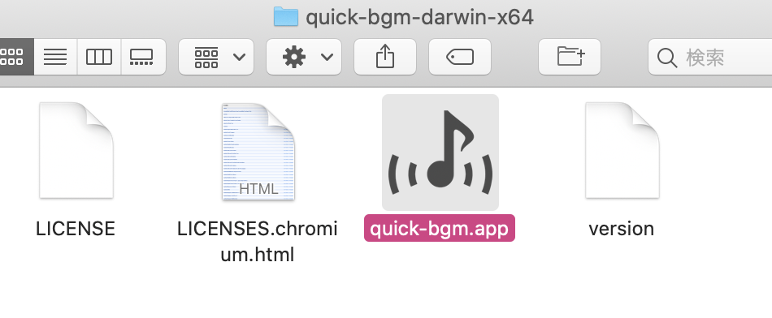
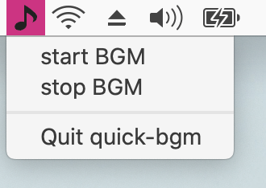
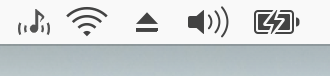

# 作ったもの

macOSのメニューバーに常駐し、BGMを流せるだけのアプリ

- 起動するとメニューバーに常駐
- start BGM で音楽開始
- stop BGM で音楽停止
- Quit でアプリ終了

https://github.com/miukoba/quick-bgm

# 必要な知識

まず公式の Quick Start Guide をやった、10分くらい

- https://www.electronjs.org/docs/tutorial/quick-start
- 後半で Electron Forge で簡単に配布できるアプリ形式を作れることが分かった
  - https://www.electronforge.io/

メニューバー常駐アプリはこの記事を参考に読んだ

- https://qiita.com/narikei/items/aaee2c7e7e1a5ae61015

# 開発内容

https://www.electronforge.io/ の方法でプロジェクトを作成

```
npx create-electron-app quick-bgm
cd quick-bgm
npm start
```

index.js, index.html をいじって `npm start` で確認の繰り返し

今回 index.js, index.html 以外は、アプリ用のアイコン作ったり、mp3や画像ファイルを置いたりしただけ

最後に実施するアプリのパッケージ作成は下記コマンド

```
npm run make
```

## つまったところ

画面無しのアプリなので BrowserWindow を作成せず、メインプロセス（ `index.js` ）で直接音を鳴らそうとしたが、うまく行かず、下記を見つけた

[node.js - Playing Audio in Electron from main process - Stack Overflow](https://stackoverflow.com/questions/60601215/playing-audio-in-electron-from-main-process)

一旦これで音を鳴らすことができた

- 見えない `BrowserWindow` を作成
  - `width: 0, height: 0`
- javascript で HTML5 の `HTMLAudioElement` を作成
  - `new Audio('path/to/file')`
- ICP 通信でAudioの再生・停止を制御
  - `mainWindow.webContents.send` , `ipcRenderer.on('play-bgm', (event, args)`
  - ICP通信はこの記事を参考にした [Electron IPC通信を行う方法まとめ │ Web備忘録](https://webbibouroku.com/Blog/Article/electron-ipc)
  - これも簡単にするため `nodeIntegration: true` を指定して、index.htmlで `require('electron')` してしまっているが、セキュリティ的にあまり良くないのでやめたほうがいいらしい

音楽を再生する他の方法を調べると、Electronの音楽プレイヤーアプリ等で `WebAudio API` を使用しているコードもあった。ただ結構複雑そうだったため一旦は簡単な方法で妥協した

簡単な方法や分わかりやすい解説があれば知りたいです

## メインのコード

index.js

```javascript
const {app, BrowserWindow, Tray, Menu, MenuItem} = require('electron')

const ICON_PATH_PLAYING = `${__dirname}/img/icon_playing.png`
const ICON_PATH_STOPPING = `${__dirname}/img/icon_stopping.png`

let mainWindow
let tray

app.on('ready', () => {
  tray = new Tray(ICON_PATH_STOPPING)
  const menu = new Menu()

  menu.append(new MenuItem({
    label: 'start BGM',
    click: () => {
      startMusic()
    },
  }))
  menu.append(new MenuItem({
    label: 'stop BGM',
    click: () => {
      stopMusic()
    },
  }))
  menu.append(new MenuItem({type: 'separator'}))
  menu.append(new MenuItem({role: 'quit'}))

  tray.setContextMenu(menu)

  createWindow()
})

app.on('ready', () => {
  app.dock.hide()
})

const createWindow = () => {
  mainWindow = new BrowserWindow({
    // width: 100, height: 800, webPreferences: {
    width: 0, height: 0, webPreferences: {
      nodeIntegration: true, // FIXME セキュリティ的に良くない
    },
  })
  mainWindow.loadFile(`${__dirname}/index.html`)
  // mainWindow.webContents.openDevTools()
}

const startMusic = () => {
  tray.setImage(ICON_PATH_PLAYING)

  if (mainWindow !== null) {
    mainWindow.webContents.send('play-bgm')
  }
}

const stopMusic = () => {
  tray.setImage(ICON_PATH_STOPPING)

  if (mainWindow !== null) {
    mainWindow.webContents.send('stop-bgm')
  }

}
```

index.html

```html

<DOCTYPE html>
  <html>
  <head>
    <meta charset="UTF-8">
    <title>player</title>
  </head>
  <body>
  <script>
    const audio = new Audio('./audio/restaurant1.mp3')
    audio.loop = true
    const ipcRenderer = require('electron').ipcRenderer

    ipcRenderer.on('play-bgm', (event, args) => {
      audio.play()
    })

    ipcRenderer.on('stop-bgm', (event, args) => {
      audio.pause()
    })
  </script>
  </body>
  </html>
```

## 完成物

アプリ



メニュー



再生中のアイコン表示



# まとめ

1から初めたが、調べながら数時間くらいでできた

全部入りみたいな感じで楽をしているせいもあるかもだが、これだけのアプリでも 179MB位になった。サイズが大きいのは少し気になる。（今回使ったmp3ファイルは 300KB くらいなので、mp3のせいではない）

とても簡単にできたので、ちょっとした機能が欲しいときに簡単なアプリを作ってみたりするのは面白そうだと思った
